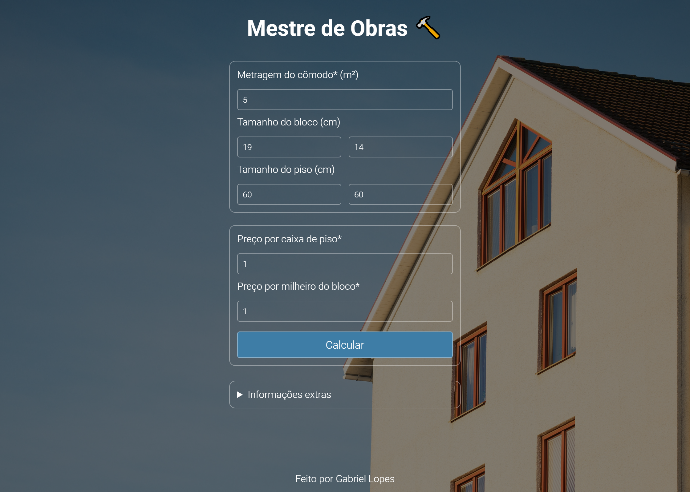
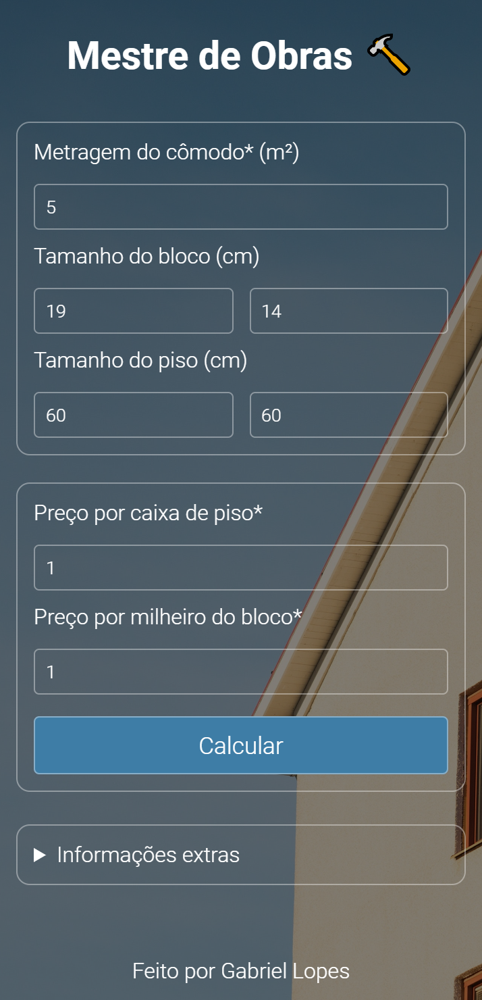

# Mestre de Obras

Entrada para o Challenge Week 2022 da Resilia.

O projeto consiste em um algoritimo para calculos de custos de materiais de construção. 

     

Web app: https://mestre-de-obras.vercel.app/

### Features

* <b>Interface simples e intuitiva</b>
* <b>Layout responsivo</b></br>
* <b>Conversão e tratamento autómatico de valores</b>
* <b>Testes unitários</b>

## 🤳 Layout

| Desktop                                  | Mobile                                 |
| ---------------------------------------- | -------------------------------------- |
|  |  |

## 📥 Instalação local

1. Instale o [Node.js](https://nodejs.org/en/).

2. Faça o download como ZIP clicando neste [link](https://github.com/C836/Mestre-de-Obras/archive/refs/heads/main.zip) e extraia a pasta no local de sua preferência ou siga o passo a passo para fazer a instalação através do terminal do [Git:](https://git-scm.com/)

```bash
# Navegue pelos arquivos com o comando "cd" e faça o download do projeto

# Via SSH
$ git clone git@github.com:C836/Mestre-de-Obras.git
# ou via HTTPS
$ git clone https://github.com/C836/Mestre-de-Obras.git

# Após o download, entre na pasta raiz da aplicação
$ cd Mestre-de-Obras
```

3. Navegue até diretório raiz, instale as dependências necessárias e inicie a aplicação.

```bash
$ npm install

$ npm start
```

## 📝 Licença

<b>Copyright (c) 2022 Gabriel Lopes</b>

Esse projeto está sob a licença MIT. Veja o arquivo [LICENSE](https://github.com/C836/Mestre-de-Obras/blob/main/LICENSE) para mais detalhes.
